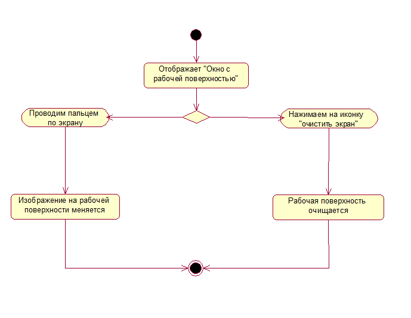

# Диаграммы активностей
## 1. Открыть сохраненное изображение.
При нажатии в главном окне приложения иконки "Открыть сохраненное изображение" пользователю открывается окно с сохраненными картинками. После нажатия на иконку с сохраненной картинкой открывается окно с рабочей поверхностью. Если сохраненные картинки отсутствуют, то выводится сообщение об отсутствии сохраненных изображений и приложение выходит в главное окно.

## 2. Закрыть приложение.
При нажатии иконки "Закрыть приложение" приложение закрывается без сохранения.

## 3. Создать новое изображение.
При нажатии иконки "Добавить изображение" открывается "Окно с рабочей поверхностью". Если пользователь проведет пальцем по экрану, появится изображение. Если нажмет на иконку "Очистить экран", рабочая поверхность вновь становится белой.

## 4. Изменить рабочий инструмент.
В "Окне с рабочей поверхностью" в правой панели инструментов пользователь может поменять цвет пера. А при нажатии иконки "Инструменты" пользователь попадает в окно, в котором может поменять толщину пера, а также заменить его на ластик и обратно.

## 5. Сохранить изображение.
При нажатии иконки "Сохранить" пользователь попадает в окно "Сохранения". Введя имя картинки и нажав кнопку "Сохранить", пользователь сохраняет свое приложение в памяти устройства. Если имя не введено, всплывает сообщение о необходимости ввести имя, а затем вновь предлагается пользователю ввести имя изображения. В случаи сбоя при сохранении всплывает сообщение об ошибке.

## 6. Отменить и повторить действие.
В "Окне с рабочей поверхностью" иконками "Отменить последнее действие" и "повторить действие" пользователь может менять состояние рабочей поверхности на предыдущее и отмененное.

