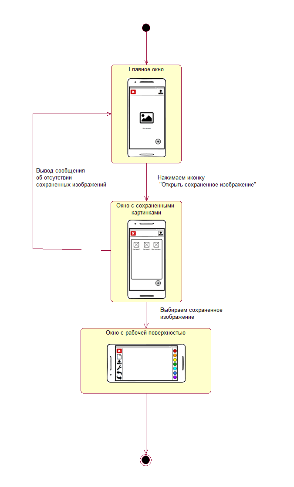
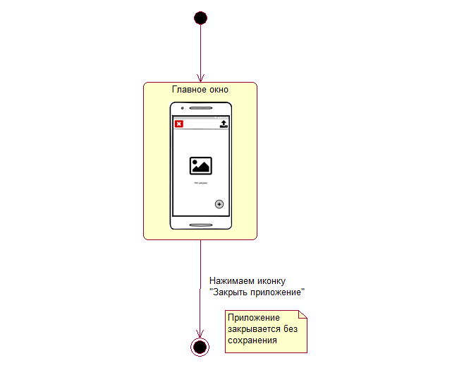
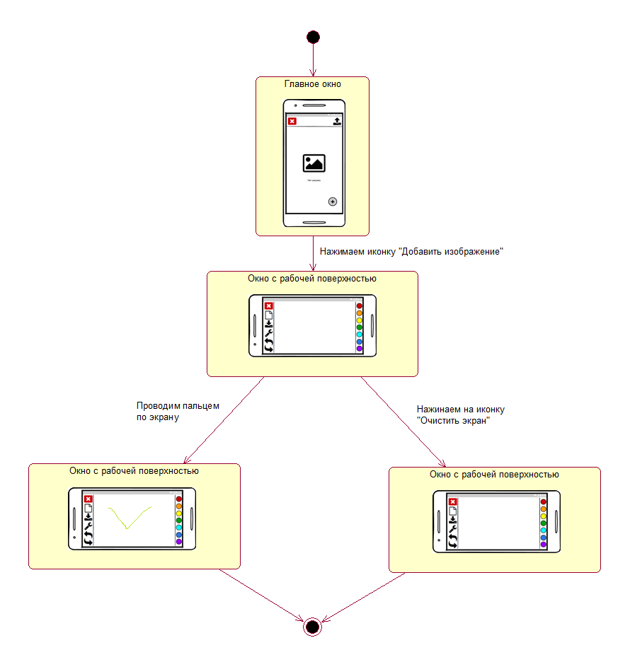
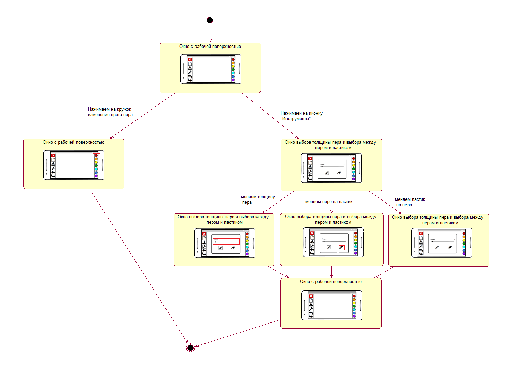
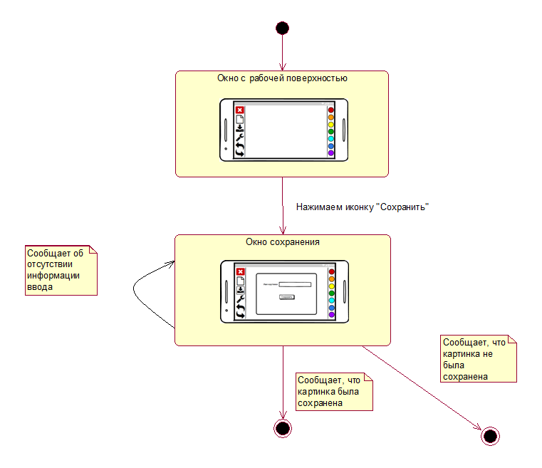
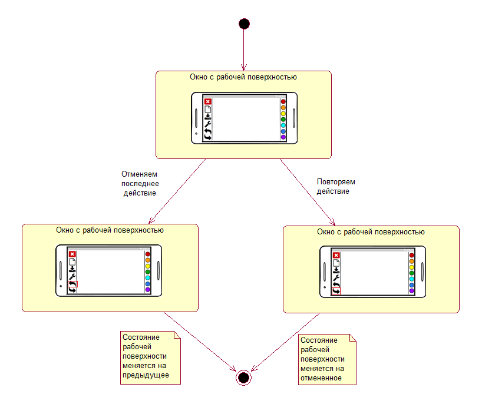

# Диаграммы состояния.
## 1. Открыть сохраненное изображение.

## 2. Закрыть приложение.

## 3. Создать новое изображение.

## 4. Изменить рабочий инструмент.

## 5. Сохранить изображение.

## 6. Отменить и повторить действие.

