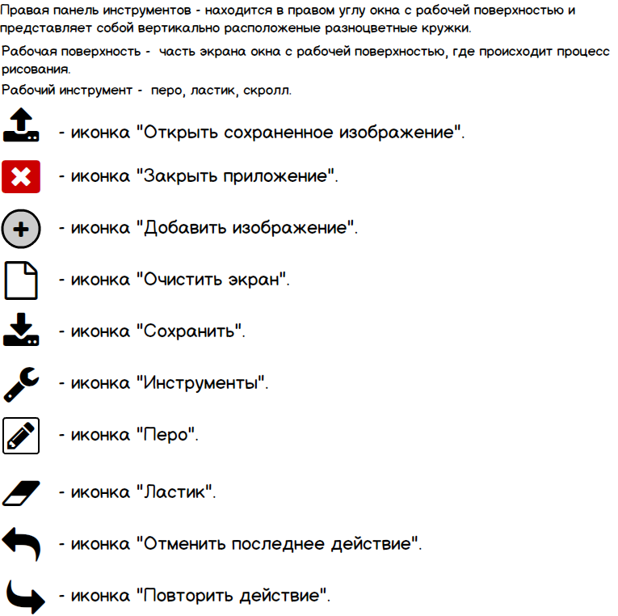
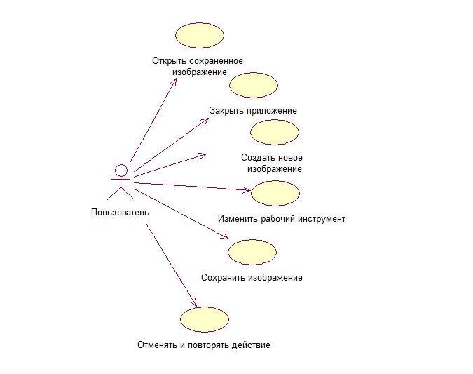

# Глосарий

# 1. Диаграмма вариантов использования

# 2. Поток событий
## 2.1. Открыть сохраненное изображение
### Описание
Вариант использования "Открыть сохраненное изображение" позволяет  пользователю открыть окно с сохраненными картинками.
### Предусловие
Пользователь нажал иконку "Открыть сохраненное изображение".
### Основной поток
1. Приложение отображает окно с сохраненными картинками.
2. Пользователь выбирает одно из сохраненных изображений. Если сохраненных картинок нет выполняется альтернативный поток А1.
3. Приложение отображает "Окно с рабочей поверхностью".
4. Вариант использования завершается.

### Альтернативный поток А1.
1. Приложение сообщает пользователю об отсутствии сохраненных картинок.
2. Вариант использования завершается досрочно.

## 2.2. Закрыть приложение
### Описание
Вариант использования "Закрыть приложение" позволяет  пользователю закрыть приложение.
### Предусловие
Пользователь нажал иконку "Закрыть приложение".

### Основной поток
1. Приложение закрывается без сохранения.
2. Вариант использования завершается.

## 2.3. Создать новое изображение
### Описание
Вариант использования "Создать новое изображение" позволяет  пользователю работать с рабочей поверхностью.
### Предусловие
Пользователь нажал иконку "Добавить изображение" - открывается "Окно с рабочей поверхностью".
### Основной поток
1. Приложение отображает "Окно с рабочей поверхностью".
2. Пользователь проводит пальцем по экрану. При данном действии выполняется альтернативный поток А1.
3. Пользователь нажал иконку "Очистить экран". При данном действии выполняется альтернативный поток А2.  
4. Вариант использования завершается.

### Альтернативный поток А1.
1. Изображение на рабочей поверхности меняется.
2. Вариант использования завершается.

### Альтернативный поток А2.
1. Рабочая поверхность очищается.
2. Вариант использования завершается.

## 2.4. Изменить рабочий инструмент.
### Описание
Вариант использования "Изменить рабочий инструмент" позволяет пользователю менять в пикселях толщину нарисованной линии, менять цвет пера на любой из 7 цветов радуги, менять перо на ластик и обратно.
### Предусловие
Пользователь нажимает иконки "Инструменты", на любой цветной кружок из 7 правой панели инструментов.
### Основной поток
1.  Приложение отображает "Окно с рабочей поверхностью".
2. Пользователь нажимает на иконку "Инструменты". При данном действии выполняется альтернативные потоки А1, А2, А3.
3. Пользователь, нажимая на любой кружок из 7 правой панели инструментов, меняет цвет пера.
4. Вариант использования завершается.

### Альтернативный поток А1.
1. Приложение отображает "Окно выбора толщины пера и выбора между пером и ластиком".
2. Пользователь меняет положение скрола "толщина" на необходимое количество пикселей.
3.  Выходит в "Окно с рабочей поверхностью".
4. Вариант использования завершается.

### Альтернативный поток А2.
1. Приложение отображает "Окно выбора толщины пера и выбора между пером и ластиком".
2. Пользователь меняет иконку "перо" на иконку "ластик".
3.  Выходит в "Окно с рабочей поверхностью".
4. Вариант использования завершается.

### Альтернативный поток А3.
1. Приложение отображает "Окно выбора толщины пера и выбора между пером и ластиком".
2. Пользователь меняет иконку "ластик" на иконку "перо".
3. Выходит в "Окно с рабочей поверхностью".
4. Вариант использования завершается.

## 2.5. Сохранить изображение
### Описание
Вариант использования "Сохранить изображение" позволяет  пользователю открыть "Окно сохранения".
### Предусловие
Пользователь нажал икону "Сохранить".
### Основной поток
1. Приложение отображает "Окно сохранения".
2. Пользователь вводит имя картинки.
3. Пользователь нажимает кнопку "Сохранить". Если пользователь ничего не ввел выполняется альтернативный поток А1.
4. Изображение сохраняется и отображается "Окно с рабочей поверхностью".
Если изображение не сохраняется то выполняется поток ошибки Е1.
5. Вариант использования завершается.

### Альтернативный поток А1
1. Приложение сообщает пользователю об отсутствии информации в поле ввода.
2. Возврат к п.1 основного потока.

### Поток ошибки E1.
1. Приложение сообщает пользователю что картинка не была сохраненна.
2. Вариант использования завершается досрочно.

## 2.6. Отменить и повторить действие
### Описание
Вариант использования "Отменить и повторить действие" позволяет  пользователю менять состояние рабочей поверхности.
### Предусловие
Пользователь нажимает иконки "Отменить последнее действие" и "Повторить действие".
### Основной поток
1.  Приложение отображает "Окно с рабочей поверхностью".
2. Пользователь нажимает иконки "Отменить последнее действие".
При данном действии выполняется альтернативный поток А1.
3. Пользователь нажимает иконки "Повторить действие".
При данном действии выполняется альтернативный поток А2.

### Альтернативный поток А1
1. Состояние рабочей поверхности меняется на придыдущее.
2. Вариант использования завершается.

### Альтернативный поток А2
1. Состояние рабочей поверхности меняется на отмененное.
2. Вариант использования завершается.
